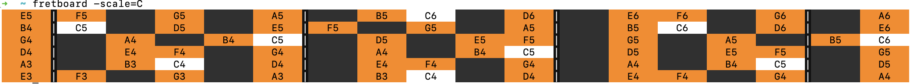
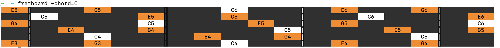
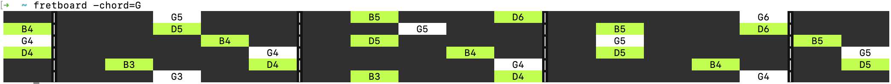
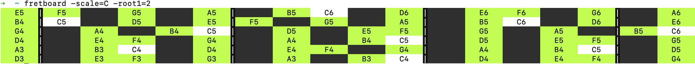
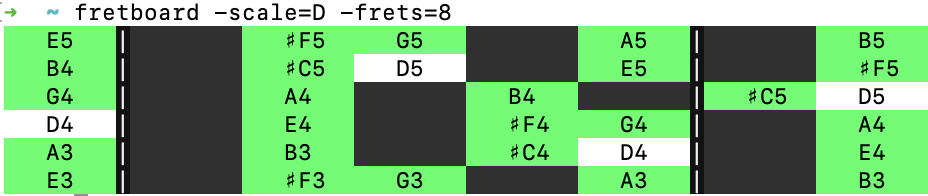
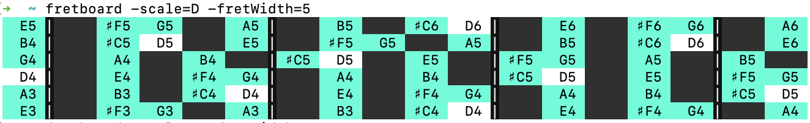
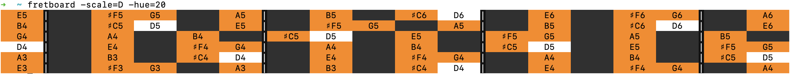
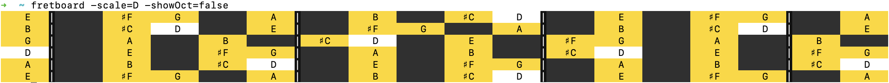
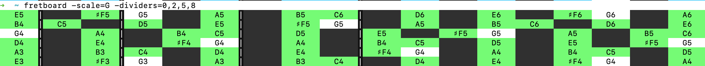

# fretboard
Display fretboards with hightlight notes of specific scale or chords in your terminal.

## Install

```
 npm install -g fretboard-cli
```

## Usage

```
fretboard [-scale=|-chord=][[#]A-G]
fretboard [-scale=|-chord=][[#]A-G]
          [-root1=4] [-root2=9] [-root3=14] 
          [-root4=19] [-root5=23] [-root6=28] 
          [-frets=18] [-fretWidth=8] [-dividers=0,5,10,15]
          [-showOct=true] [-hue=277]
```

### Scale

Show major scale of C:
```
fretboard -scale=C
```


### Chords

Show major chords of C:
```
fretboard -chord=C
```


Show major chords of G:
```
fretboard -chord=G
```


### Tuning

Special tuning:

Change the first string from E4(4) to D4(2):
```
fretboard -scale=C -root1=2
```


### Frets

Config frets count:
```
fretboard -scale=D -frets=8
```


Config fret width:
```
fretboard -scale=D -fretWidth=5
```


### Style

Specific color:
```
fretboard -scale=D -hue=20 
```


Hide oct:
```
fretboard -scale=D -showOct=false
```


Config dividers:
```
fretboard -scale=G -dividers=0,2,5,8
```


